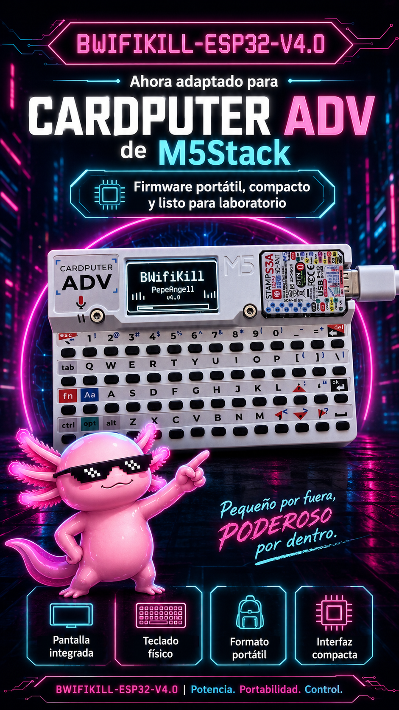
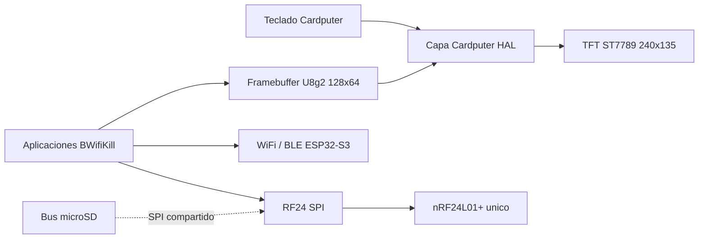
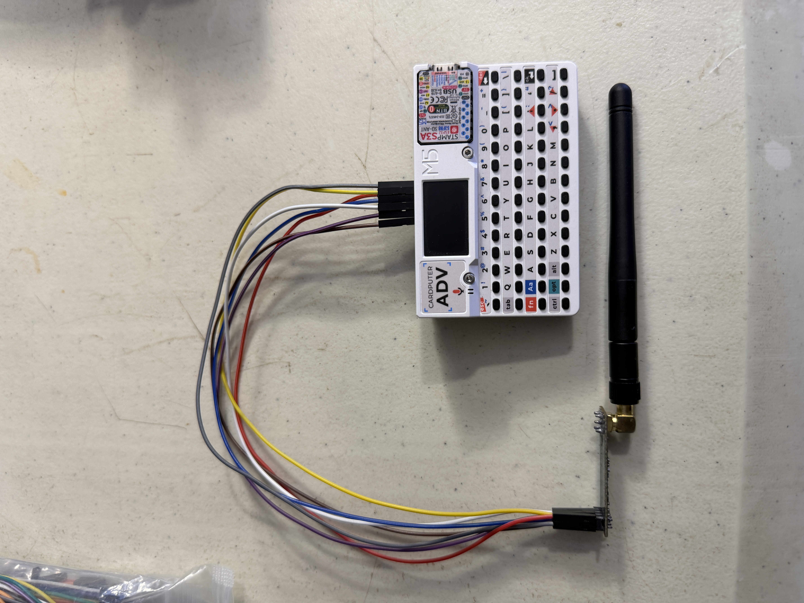
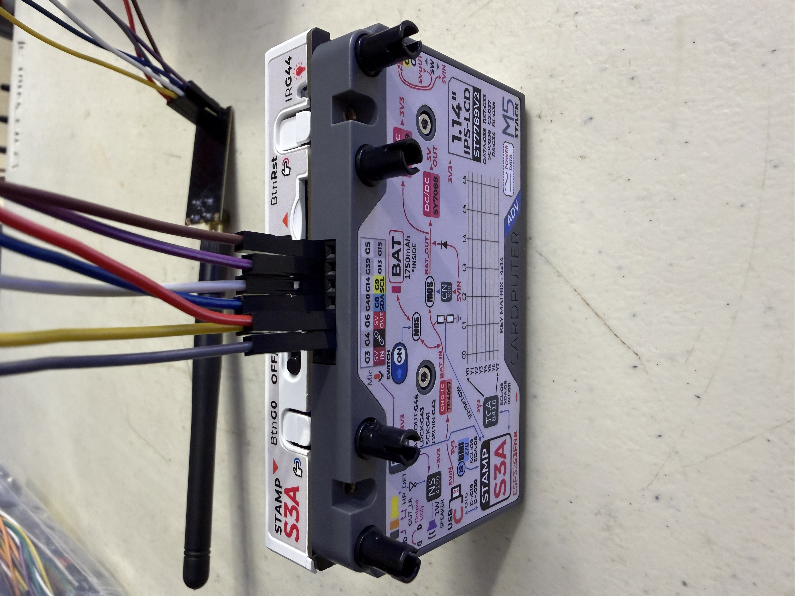
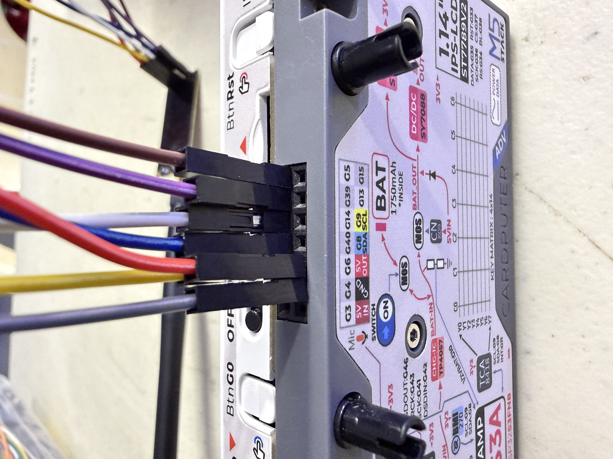
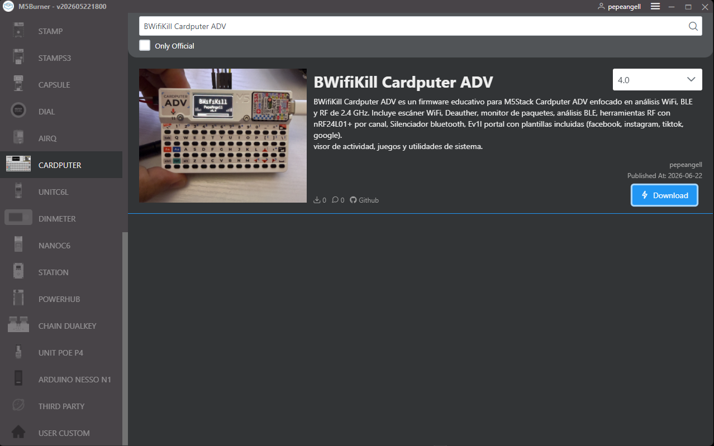
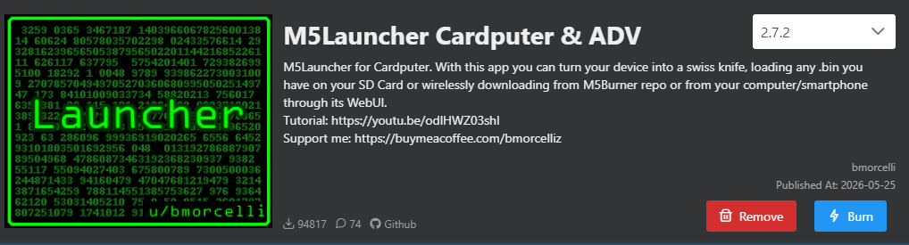
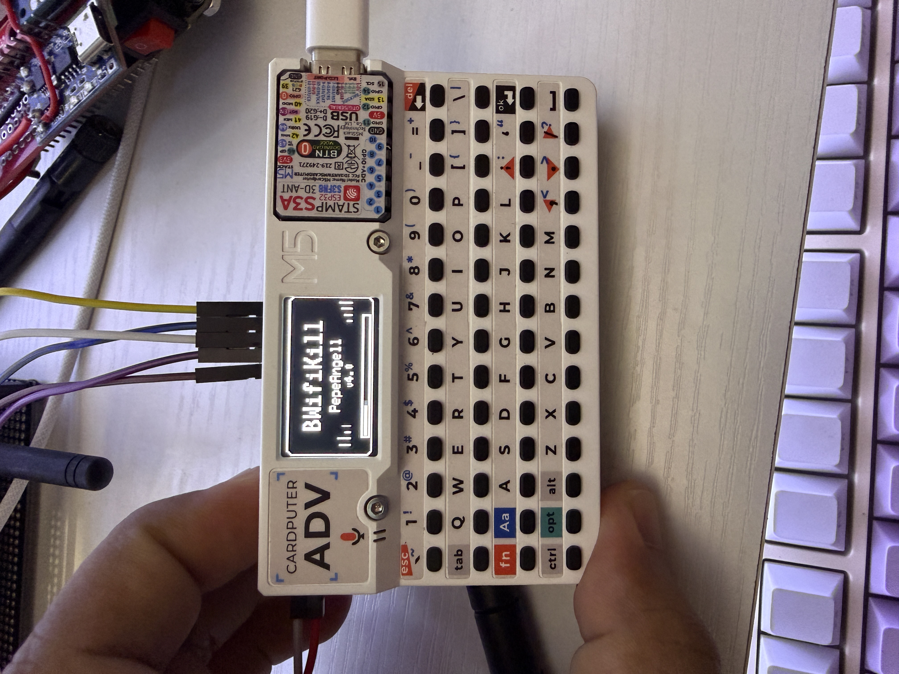
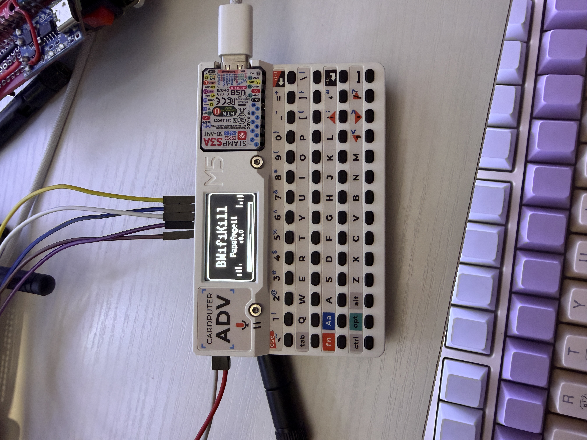

# BWifiKill Cardputer ADV


[](https://pepeangell5.github.io/BWifiKill-CARDPUTER-ADV/)
[](https://github.com/pepeangell5/BWifiKill-CARDPUTER-ADV)

Port oficial de **BWifiKill ESP32 V4.0** para el dispositivo comercial
**M5Stack Cardputer ADV**. La migracion conserva las herramientas WiFi,
Bluetooth y RF del proyecto original, reemplaza el OLED y los botones por la
pantalla y teclado integrados, y adapta las funciones RF para trabajar con un
solo nRF24L01+.

> Proyecto educativo para investigacion, aprendizaje de electronica, analisis
> pasivo y auditorias expresamente autorizadas. Las funciones de laboratorio
> deben utilizarse exclusivamente sobre equipos propios y en entornos RF
> controlados.

<p align="center">
  
</p>

## Contenido

- [Caracteristicas](#caracteristicas)
- [Arquitectura](#arquitectura)
- [Hardware](#hardware)
- [Conexion del nRF24](#conexion-del-nrf24)
- [Controles](#controles)
- [Funciones](#funciones)
- [Instalacion](#instalacion)
- [Compilacion](#compilacion)
- [Galeria](#galeria)
- [Migracion desde V4.0](#migracion-desde-v40)
- [Limitaciones conocidas](#limitaciones-conocidas)
- [Uso responsable](#uso-responsable)
- [Autor y licencia](#autor-y-licencia)

## Caracteristicas

- Firmware modular con 30 entradas organizadas por categorias.
- Interfaz original renderizada en el TFT ST7789 integrado de 240x135.
- Navegacion completa desde el teclado fisico del Cardputer ADV.
- WiFi y BLE internos del ESP32-S3.
- Un nRF24L01+ externo para analisis y comunicacion RF en 2.4 GHz.
- Herramientas originalmente duales convertidas a muestreo secuencial.
- Web Flasher compatible con ESP32-S3.
- Binario completo y segmentos separados con checksums SHA-256.
- Entorno original `esp32dev` conservado junto al nuevo `cardputer_adv`.

## Arquitectura



La capa `cardputer_compat` permite mantener el codigo visual probado de V4.0.
El framebuffer monocromatico se escala y centra en el TFT, mientras el teclado
se traduce a los cinco controles logicos que usaba el firmware original.

## Hardware

| Componente | Cantidad | Descripcion |
| --- | ---: | --- |
| M5Stack Cardputer ADV | 1 | Plataforma principal con ESP32-S3, TFT, teclado y bateria. |
| nRF24L01+ | 1 | Radio externa de 2.4 GHz; se recomienda version PA/LNA con antena. |
| Capacitor | 1 | Entre 10 uF y 100 uF, colocado cerca de VCC/GND del nRF24. |
| Cables Dupont | 7 | Alimentacion, tierra, SPI, CE y CSN. |

<p align="center">
  
</p>

### Modulo RF recomendado

El proyecto esta pensado para trabajar con un solo modulo **nRF24L01+**. Para
mejor estabilidad se recomienda usar un modulo PA/LNA con antena externa y
agregar un capacitor entre VCC y GND lo mas cerca posible del radio.

<p align="center">
  
  
  
</p>

## Conexion del nRF24

El firmware utiliza el bus SPI de la microSD y reserva GPIO5/GPIO6 para control
de la radio.

| Pin nRF24L01+ | Cardputer ADV | Funcion |
| --- | ---: | --- |
| VCC | `3V3` regulado | Alimentacion. No conectar directamente a 5 V. |
| GND | `GND` | Tierra comun. |
| CE | `GPIO 5` | Habilitacion de radio. |
| CSN / CS | `GPIO 6` | Seleccion SPI del nRF24. |
| SCK | `GPIO 40` | Reloj SPI compartido. |
| MOSI | `GPIO 14` | Datos Cardputer hacia nRF24. |
| MISO | `GPIO 39` | Datos nRF24 hacia Cardputer. |
| IRQ | Sin conexion | El firmware trabaja por consulta. |

Configuracion utilizada por el firmware:

```text
SCK=40  MISO=39  MOSI=14  CE=5  CSN=6  SPI=10 MHz
```

> El bus se comparte con la microSD. Para las primeras pruebas se recomienda
> retirar la tarjeta. Si ambos dispositivos se usan simultaneamente, cada uno
> debe mantener su propia linea CS y permanecer deseleccionado cuando no se use.

<p align="center">
  
  
</p>

## Controles

No es necesario mantener presionada la tecla `Fn`.

| Accion BWifiKill | Tecla Cardputer ADV |
| --- | --- |
| Arriba / aumentar | `;` - tecla marcada con flecha arriba |
| Abajo / disminuir | `.` - tecla marcada con flecha abajo |
| Aceptar / iniciar | `Enter` |
| Volver / detener | `Backspace / Del` |
| Accion auxiliar | `Espacio` |

## Funciones

### WiFi

| Herramienta | Descripcion |
| --- | --- |
| WiFi Scanner | Lista redes, canal, RSSI y seguridad. |
| WiFi Radar | Estimacion visual de proximidad basada en RSSI. |
| Channel Scan | Ocupacion y detalle de redes por canal. |
| Packet Monitor | Visualizacion de actividad WiFi en modo monitor. |
| Modo Centinela | Seguimiento de cambios y actividad anomala. |
| IP Scanner | Descubrimiento y diagnostico basico de hosts. |
| Web Dashboard | Panel local mediante punto de acceso del dispositivo. |

### RF Tools

| Herramienta | Descripcion |
| --- | --- |
| Analizador | Vista general de energia RF en 2.4 GHz. |
| RF Heatmap | Historial visual de actividad por bandas. |
| CH Advisor | Recomendacion de canales con menor actividad observada. |
| nRF Link | Enlace maestro/esclavo entre dispositivos propios. |
| nRF Chat | Mensajes de prueba mediante nRF24. |
| BT/WiFi Coex | Comparacion visual de las zonas WiFi y BLE. |
| NRF Scope | Canales bajos y altos medidos secuencialmente con una radio. |

### Bluetooth

| Herramienta | Descripcion |
| --- | --- |
| BT Scanner | Descubrimiento BLE con nombre, fabricante, MAC y RSSI. |
| BT Analyzer | Analisis visual de dispositivos BLE detectados. |
| BT Spectrum | Actividad BLE/RF entre 2402 y 2480 MHz. |
| BT Remote | Control BLE HID para equipos propios emparejados. |

### Laboratorio controlado

Este grupo contiene pruebas activas. No debe utilizarse fuera de un entorno
aislado o sin autorizacion explicita.

| Herramienta | Proposito de laboratorio |
| --- | --- |
| Jammer Canal | Prueba RF sobre un canal seleccionado. |
| Barrido Total | Evaluacion de barrido amplio en 2.4 GHz. |
| BT Jammer | Prueba RF enfocada en la zona Bluetooth. |
| Beacon Spam | Generacion de beacons para validar scanners propios. |
| BLE Spam | Emision BLE para pruebas de compatibilidad. |
| Modo Hibrido | Flujo combinado de pruebas WiFi y RF. |
| Evil Portal | Capacitacion local mediante portal cautivo. |
| Deauther | Pruebas de gestion WiFi en infraestructura autorizada. |

### Games y sistema

- Snake, Pong, Flappy, Invaders y Dino.
- Control esclavo, visor de logs y pantalla About.

## Instalacion

### Web Flasher

1. Abre el [Web Flasher](https://pepeangell5.github.io/BWifiKill-CARDPUTER-ADV/) con Chrome o Edge.
2. Conecta el Cardputer ADV mediante USB.
3. Cierra cualquier monitor serie que este usando el puerto.
4. Pulsa **Instalar en Cardputer ADV** y selecciona el dispositivo.
5. Si no entra en modo descarga, utiliza el boton `G0/BOOT` durante la conexion.

El Web Flasher utiliza:

```text
binarios/BWifiKill-CARDPUTER-ADV-full.bin @ 0x0000
```

### Instalacion directa desde M5Burner

BWifiKill tambien esta disponible en el catalogo de **M5Burner**:

1. Abre M5Burner y selecciona la categoria **Cardputer**.
2. Busca exactamente `BWifiKill Cardputer ADV`.
3. Selecciona la version disponible y pulsa **Download**.
4. Conecta el Cardputer ADV al equipo mediante USB.
5. Cuando termine la descarga, pulsa **Burn** y selecciona el puerto correcto.
6. Espera a que M5Burner confirme la escritura y reinicia el dispositivo.

<p align="center">
  
</p>

### Instalacion manual

```bash
esptool.py --chip esp32s3 --baud 921600 write_flash \
  0x0 binarios/BWifiKill-CARDPUTER-ADV-full.bin
```

Tambien se conservan el bootloader, la tabla de particiones y la aplicacion
como artefactos de referencia. Consulta [binarios/README.md](binarios/README.md)
y `binarios/checksums-sha256.txt` para verificar integridad.

### Instalacion desde M5Launcher y microSD

Tambien puedes instalar BWifiKill sin computadora desde **M5Launcher
Cardputer & ADV**:

1. Copia `binarios/BWifiKill-CARDPUTER-ADV-full.bin` a una tarjeta microSD.
2. Inserta la microSD en el Cardputer ADV.
3. Inicia M5Launcher y abre el explorador de archivos de la tarjeta SD.
4. Selecciona `BWifiKill-CARDPUTER-ADV-full.bin`.
5. Pulsa **Burn**, confirma la escritura y espera a que finalice.
6. Reinicia el Cardputer ADV para iniciar BWifiKill.

> Debes elegir el archivo `-full.bin`. No selecciones `firmware.bin`,
> `bootloader.bin` ni `partitions.bin` desde M5Launcher.

<p align="center">
  
</p>

## Compilacion

Requisitos:

- Visual Studio Code con PlatformIO, o PlatformIO Core.
- Cable USB con datos.
- Cardputer ADV conectado.

```bash
git clone https://github.com/pepeangell5/BWifiKill-CARDPUTER-ADV.git
cd BWifiKill-CARDPUTER-ADV
pio run -e cardputer_adv
pio run -e cardputer_adv -t upload
```

El entorno utiliza `m5stack-stamps3`, Arduino para ESP32, M5Cardputer,
M5Unified, RF24 y U8g2. La ultima compilacion validada ocupa aproximadamente
45.5% de RAM y 53% de la particion de aplicacion.

## Galeria

<p align="center">
  
  
</p>

## Migracion desde V4.0

| Area | BWifiKill ESP32 V4.0 | Cardputer ADV |
| --- | --- | --- |
| Plataforma | ESP32 DevKit / WROOM | M5Stack Cardputer ADV / ESP32-S3 |
| Pantalla | OLED SSD1306 128x64 | TFT ST7789 240x135 |
| Entrada | Cinco botones externos | Teclado fisico integrado |
| Radio externa | Dos nRF24L01+ | Un nRF24L01+ |
| Herramientas duales | Muestreo simultaneo | Muestreo secuencial bajo/alto |
| Alimentacion | Bateria y regulacion externas | Bateria y carga integradas |
| Montaje | PCB o protoboard personalizada | Plataforma comercial compacta |
| Flasheo | ESP32 clasico | ESP32-S3 por USB/Web Serial |

La migracion conserva el entorno `esp32dev` para referencia, pero
`cardputer_adv` es el entorno predeterminado del proyecto.

## Limitaciones conocidas

- El TFT muestra una interfaz compatible de 128x64 escalada a 240x120; no todas
  las pantallas aprovechan todavia color o resolucion nativa.
- El unico nRF24 mide de forma secuencial las bandas que V4.0 observaba con dos
  radios. Los resultados siguen siendo utiles, pero no son simultaneos.
- El SPI del nRF24 comparte GPIO con la microSD.
- El rendimiento RF depende de alimentacion estable, desacoplo, antena y
  longitud de los cables.
- Web Serial requiere un navegador Chromium compatible y contexto HTTPS.

## Estructura del proyecto

```text
BWifiKill-CARDPUTER-ADV/
|-- .github/workflows/    Despliegue automatico del Web Flasher
|-- binarios/             Imagen completa, segmentos y checksums
|-- img/Cardputer/        Fotografias del montaje y funcionamiento
|-- img/componentes/      Referencias visuales del nRF24L01+
|-- include/              Configuracion y cabeceras
|-- src/                  Aplicaciones y capa de compatibilidad
|-- index.html            Interfaz del Web Flasher
|-- manifest.json         Manifest ESP Web Tools para ESP32-S3
|-- platformio.ini        Entornos cardputer_adv y esp32dev
`-- README.md             Documentacion principal
```

## Uso responsable

Este firmware se distribuye con fines educativos y de investigacion. El
usuario es responsable de cumplir la legislacion aplicable, evitar
interferencias y obtener permiso antes de evaluar redes o dispositivos ajenos.

El autor no se responsabiliza por danos, interrupciones, perdida de datos, uso
indebido o consecuencias legales derivadas del proyecto.

## Autor y licencia

Desarrollado por **PepeAngell**.

- GitHub: [pepeangell5](https://github.com/pepeangell5)
- Instagram: [@pepeangelll](https://www.instagram.com/pepeangelll)
- Facebook: [esp32tools](https://www.facebook.com/esp32tools)

Distribuido bajo licencia MIT. Consulta [LICENSE](LICENSE).
